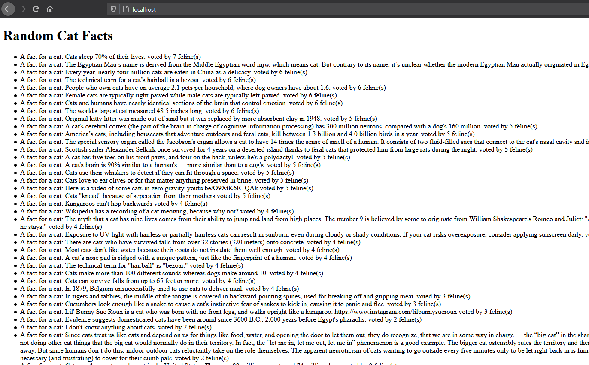

# AJAX Assignment

The goal of this assingnment is to challenge my knowledge of using AJAX to fetch data from an API. In this assignment I chose [Cat Facts](https://alexwohlbruck.github.io/cat-facts/) API. 

## Installation

````bash
$ git clone https://github.com/jia-von/ajax-axios-assignment.git
$ cd ajax-axios-assignment-jia-von
$ php -S localhost:80
``````

## Approach

- I fetched at least three different sets of data from te API.
- The data fetched was displaed in the user's browser as a list.

### Result

